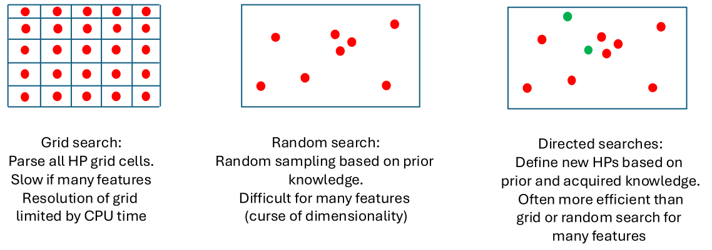
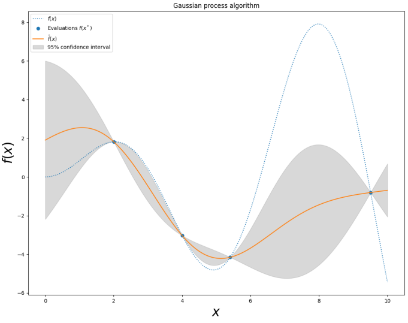
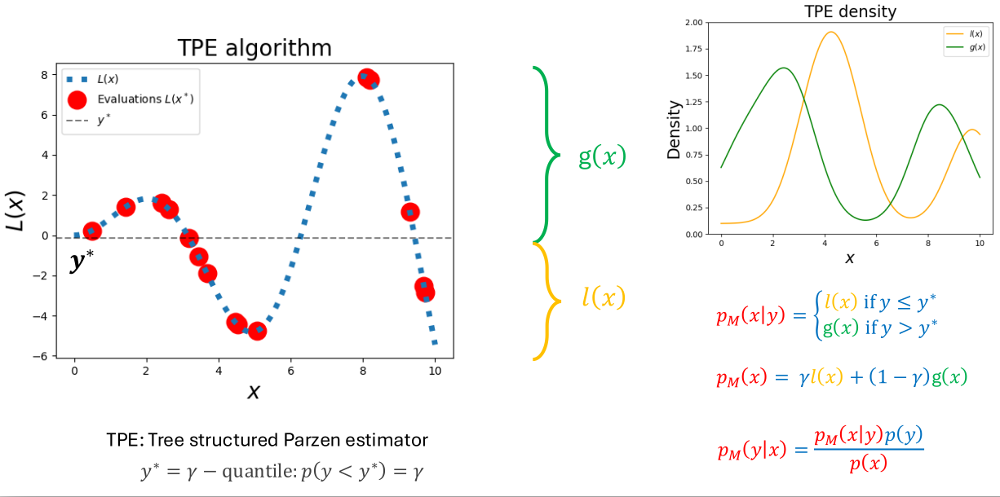

# XGBoost model tuning through Bayesian Optimization of the hyperparameter space with Hyperopt

<figure>

  

<figcaption align="center"><b>Figure.</b> Comparison of hyperparameter search strategies.</figcaption>
</figure>
 

In XGBoost, these three concepts - grid search, random search, and directed (Bayesian) search - refer to ways of tuning hyperparameters to get the best-performing model:

- Grid Search: exhaustively check all combinations in a predefined grid of hyperparameters. It tries every combination. It's almost never optimal for XGBoost because the space is too large and interactions between hyperparameters are nonlinear.
- Random Search: randomly sample hyperparameter combinations. Much more efficient than grid search, but still doesn’t 'learn' from past evaluations and performance variance is high if we tune too many parameters at once.
- Directed (Bayesian): it corresponds to guided hyperparameter optimization, where the next set of hyperparameters depends on past results. It's the most efficient method for large hyperparameter spaces like XGBoost. It finds good hyperparameters with fewer trials, can tune many dimensions at once and learns from the model's behavior.

Hyperopt is one of the Python libraries for hyperparameter optimization, and its core novelty is the TPE algorithm (Tree-structured Parzen Estimator). Instead of sampling hyperparameters randomly or on a grid, TPE builds two probabilistic models (x = hyperparameters):

- `l(x)`: distribution of hyperparameters that produced good results
- `g(x)`: distribution of hyperparameters that produced bad results

Then, it picks new hyperparameters that maximize the ratio: `l(x) / g(x)`. TPE samples more from regions that look promising, and avoids regions that previously performed poorly. XGBoost has many interacting hyperparameters and TPE handles this better than grid or random search. TPE uses Bayesian reasoning to "learn" good regions as it goes.

<figure>

  

  <figcaption align="center"><b>Figure.</b> Hyperopt's bayesian HP exploration. The true loss function is unknown (blue dotted). We only see scattered evaluations (blue dots). The optimizer builds a model of the landscape (orange). It also tracks uncertainty (grey).</figcaption>
</figure>
 
Even though Hyperopt uses TPE (not Gaussian Processes), the figure above shows the general Bayesian idea: try hyperparameters → model the unknown loss function → pick next hyperparameters using the model + uncertainty.
  

Instead of modeling loss as a function of hyperparameters, TPE models hyperparameters given the loss. This is a clever trick that makes Bayesian optimization work better in high dimensions. Modeling loss as a function of hyperparameters is `p(y|x)` which means gven a hyperparameter vector x, predict the loss y. This is hard because the function is non-smooth, has many dimensions, has conditional branches, may have discontinuities and interactions are highly nonlinear. It's easier to flip it and to model hyperparameters conditioned on loss `p(x|y)`, because then we ask: given how good or bad the loss is, what kind of hyperparameters tend to produce it? TPE splits the search into two simple distributions: `l(x)` for "good" hyperparameters (low loss), `g(x)` for "bad" hyperparameters (high loss). And models them separately using simple 1D kernel density estimators.

<figure>

  

  <figcaption align="center"><b>Figure.</b> Hyperopt's TPE algorithm - the way it chooses the next hyperparameters to try. Left: It splits past trials into good and bad results. Right: It models where good/bad hyperparameters lie and sample from the good region.</figcaption>
</figure>
 

In figure above the left graph: we try several hyperparameter values. Each trial gives us a red dot on the loss function L(x). We don't know the true curve (the blue dotted line) - we only see the red dots (our observations). We split them into good `l(x)` and bad `g(x)`. Why the quantile is important? Hyperopt chooses `y∗` such that: `p(y<y∗)=γ`. Usually `γ=0.15` or `γ=0.2`. This means: Best γ fraction of results -> "good" and the rest -> "bad". This quantile split is the core idea of TPE, because it allows the algorithm to focus on regions where good hyperparameters tend to cluster. On the right graph: from the good and bad trials we estimate two probability distributions `l(x)` and `g(x)`. The algorithm then tries to pick the next hyperparameters that look similar to the ones that performed well i.e. large `l(x)` and do not look like the ones that performed badly i.e. small `g(x)`.

After tuning the hyperparameters with Hyperopt, we use model interpretation techniques to explain the predictions made by the trained model. SHAP (Shapley Additive Explanations) and LIME (Local Interpretable Model-Agnostic Explanations) are two key methods used to gain insights into how the model makes predictions. These techniques allow us to interpret which biomarkers/features are important, how they affect the predicted outcome, and how individual predictions are formed. SHAP values allow us to interpret feature impacts for both global trends (show the overall feature importance across all predictions) and specific instances (local explanations break down the contribution of each feature to individual predictions), with visualizations like waterfall, summary, and interaction plots. LIME focuses on local explanations: it approximates the black-box model with a simpler surrogate model (e.g., linear regression) for each instance, generating new data points to understand the model’s behavior for individual predictions.

This project is the result of the [Swiss Institute of Bioinformatics (SIB) workshop Ensuring More Accurate, Generalisable, and Interpretable Machine Learning Models for Bioinformatics](https://doi.org/10.5281/zenodo.14196882).